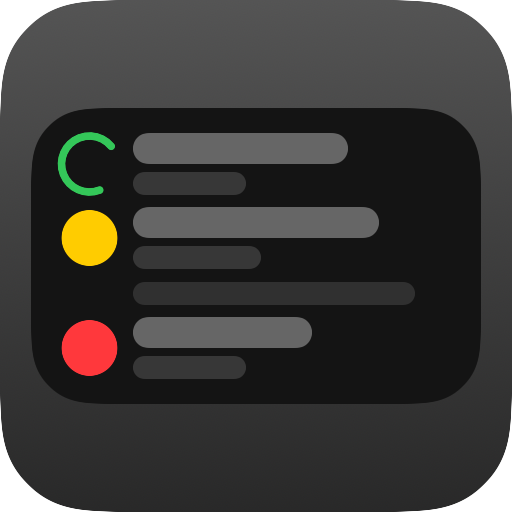

<p align="center">
  
</p>

<h1 align="center">AgentGlance</h1>

<p align="center">
  A free, open-source macOS overlay for monitoring AI coding agents in real time.
</p>

<p align="center">
  
</p>

<p align="center">
  <a href="https://agentglance.app">Website</a> &middot;
  <a href="https://github.com/hezi/AgentGlance/releases/latest">Download</a> &middot;
  <a href="https://github.com/hezi/AgentGlance/issues">Report Issue</a>
</p>

## What it does

- **Live session status** in a floating overlay — see what your agents are doing at a glance
- **Approve or deny** tool use directly from the overlay, with inline diffs for file edits
- **Answer questions** and **review plans** without switching to the terminal
- **Keyboard navigation** — global hotkey to open, arrow/number keys to act
- **Jump to terminal** — one click to the right tab (Ghostty, Terminal, iTerm, Kitty, Warp)
- **Session grouping** — organize by project or status with collapsible headers
- **Snap-to-position** — drag the overlay anywhere, snaps to edges and corners
- **Auto-updates** — get notified when a new version is available

Supports **Claude Code** and **Codex CLI**. macOS 14+ / Apple Silicon.

## Quick Start

1. **Download** the [latest release](https://github.com/hezi/AgentGlance/releases/latest), unzip, and move to Applications
2. **Launch** AgentGlance — it lives in your menu bar
3. **Connect** — click "Setup Hooks" on first launch to link your Claude Code instances

That's it. Your active sessions appear in the overlay automatically.

## Building from source

```bash
git clone https://github.com/hezi/AgentGlance.git
cd AgentGlance
open AgentGlance.xcodeproj
# Cmd+R to build and run
```

## License

MIT
